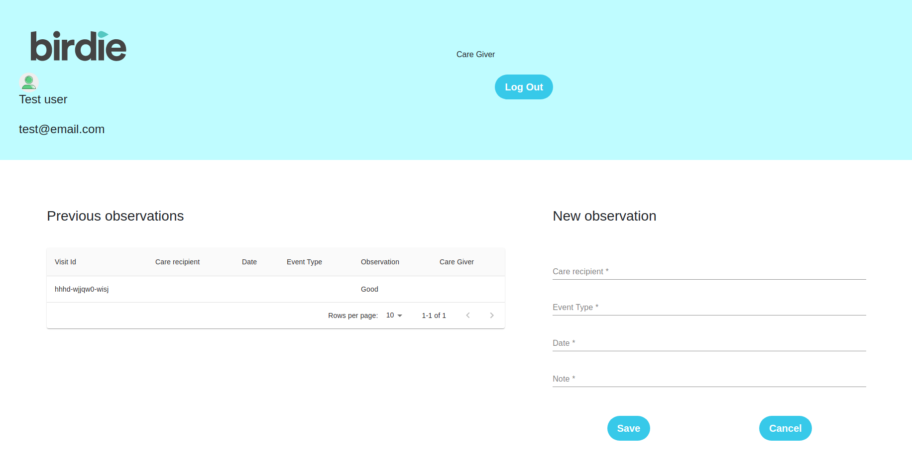

# Birdie Developer Test

> A fullstack assessment `Birdie Test` using React - Typescript - Redux - Saga - Styled-Component on the frontend, NodeJs - Typescript - Jest - Express - Sequelize on the backend
> The aim of this app is to display informations about observations `care giver` recorded about a `care recipient` with a timeline display on the frontent

## Understantanding of the challenge

Needing to display information in the format bellow
``` json
{  
   "id":"decaa026-2ce5-49cb-aff9-92326b85a98c",
   "event_type":"mood_observation",
   "visit_id":"39b94aab-cc35-4874-807f-c23472aec663",
   "timestamp":"2019-04-23T10:53:13+01:00",
   "caregiver_id":"4786d616-259e-4d52-80f7-8cf7dc6d881a",
   "care_recipient_id":"03f3306d-a4a3-4179-ab88-81af66df8b7c",
   "mood":"okay",
},
```
I decided to organize data content this way: 

1. **User**: The user can either be a familly member or a care giver with these informations: 
   ``` json
   {
      "names": "FakeUserNameTest",
      "role": "care_giver",
      "phone": 900000001,
      "email": "test@faketest.com",
      "password": "test1234",
      "confirmPassword": "test1234",
      "address": "test address"
   }
   ```
The role can be : `care_giver` or `familly_member`
Depending on the role, a user can have his UI 
> - For the care giver: His UI must allow him to register a new care recipient, record a new observation and display a list of all the precvious observations taken
> - For the Familly member, his UI will help hi to see in a timeline UI the recorded observation ordered by date from the most recent one to the oldest one
2. **Care recipient**: When a new care recipient is admited, we need to assign to him at least one created user to become his first familly member, the familly member has these informations: 
``` json
{
   "names": "Test user",
   "familly_members": "xxxxxxx-xxx-xxx-xxx, wwuwuuw-www-kk, kkwkw",
   "visits": "xxxxxx-xxxx, xxxxxx-xxxx, xxxx-xx-xxx-x"
}
```
A care recipient can have one or multiple familly member recorder in a text field with `ID` joined by `, ` and his visits id stored the same way
3. **Visit**: The visit table in the database represents the observations recorded by a certain `care_giver` for a certain `care_recipient` the sumarry of it will be shown as observation to a familly member
For a new visit, this is an example of data to record: 
``` json
{
    "note": "Everything fine for now",
    "date": "2021-04-05",
    "event_type": "mood_observation"
}
```
The event type is set in an enum, but can be changed depending on pertinance, the enum already set is a model of what can it be

## Frontend [Unachieved]
:warning: To add: `Global state management`, `Testing`, `Improvement of the UI`

1. Authentication pages
- 
- 
- 
- 

> UI contains static data, need API consumption to be functional

## Backend 
:warning: Need to complete the Unit testing for `care_recipient` and `visits`
End points: 
- **[POST]** `/api/users/register` : To create a new user
- **[POST]** `/api/users/login` : To authenticate a user
- **[POST]** *[PROTECTED]* `/api/visits/create/:care_giver_id/:care_recipient_id` : To register a new observation by `care_giver` only
- **[POST]** *[PROTECTED]* `/api/care-recipients/register/:first_familly_member` : To register a new care recipient
- **[GET]** *[PROTECTED]* `/api/visits/` : To get complete list of visits to display in the `care_recipient` UI
- **[GET]** *[PROTECTED]* `/api/visits/:familly_member_id`: To get list of visits for a `care_recipient` which belongs to a certain familly member
## Usage

1. Start the API. (Run the following commands within the `backend` folder)

   a. Install the dependencies
   ```
   npm install
   ```
   
   b. Run the HTTP server (will start on port `8000`)
   ```
   npm run dev
   ```
2. Start the React app  (Run the following commands within the `front-end` folder)

    a. Install the dependencies
   ```
   npm install
   ```
   
   b. Run the application (will start on port `3000`)
   ```
   npm start
   ```
